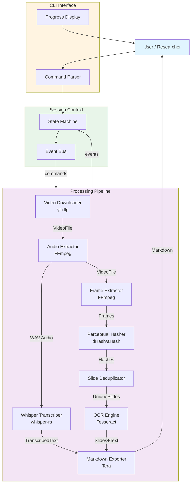
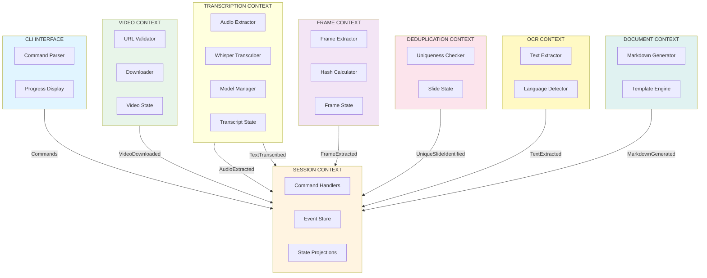

# Functional DDD: YouTube Video Slide Extractor

> Functional Domain-Driven Design specification for a CLI tool that extracts unique slides from YouTube videos with OCR and Markdown output.

---

## Table of Contents

1. [Quick Reference](#quick-reference)
2. [Architecture Overview](#architecture-overview)
3. [Functional DDD Principles](#functional-ddd-principles)
4. [Context Map](#context-map)
5. [Context Documents](#context-documents)
6. [Implementation](#implementation)

---

## Quick Reference

### Core Flow
```
User Request → Validate Command → Load State → Derive Event → Apply Event → Publish Event
```

### Key Type Definitions
| Type | Purpose | Example |
|------|---------|---------|
| `Command` | Intent to change state | `ExtractSlidesFromVideo` |
| `Event` | Something that happened | `VideoDownloaded` |
| `State` | Current entity state | `VideoProcessingSession` |
| `Error` | Domain errors | `VideoUnavailable` |
| `Id<T>` | Typed identifier | `Id<VideoProcessingSession>` |

### External Dependencies
- **yt-dlp**: Video downloading
- **FFmpeg**: Frame extraction, audio extraction
- **Whisper**: Audio transcription
- **Tesseract**: OCR processing
- **Tera**: Markdown templating

---

## Architecture Overview

### System Architecture



---

## Functional DDD Principles

### Core Concepts

**Data > Behavior**
- Entities are plain structs with data only
- Behavior implemented as pure functions
- No methods on domain objects

**Immutability**
- All domain types derive `Clone`
- State transitions create new values
- Use `&` references for read-only access

**Explicit State Transitions**
- Events are first-class citizens
- State changes via event application
- Event sourcing pattern by default

**Type-Driven Development**
- Strong typing for domain concepts
- Newtypes prevent primitive obsession
- Compile-time validation where possible

### Command Handler Lifecycle

The command handler follows a pure functional pattern:

1. Validate command input
2. Load current state
3. Derive event from command + state
4. Apply event to update state
5. Publish event to event bus

All handlers are pure functions that return a Result<event, error>.

---

## Context Map



### Context Implementation Pattern

Each bounded context follows this structure:

```
docs/
└── session/
    ├── domain/
    │   ├── commands.rs      // Command types
    │   ├── events.rs        // Event types
    │   ├── state.rs         // State types
    │   ├── handlers.rs      // Pure handler functions
    │   └── policies.rs      // Business rules
    ├── application/
    │   ├── service.rs       // Service coordination
    │   └── bus.rs           // Event bus
    └── infrastructure/
        ├── repository.rs    // State persistence
        └── publisher.rs     // Event publishing
```

---

## Context Documents

| Context | Document | Responsibility |
|---------|----------|----------------|
| **Shared** | [SHARED_FDD.md](SHARED_FDD.md) | Events, commands, errors, IDs |
| **Session** | [SESSION_FDD.md](SESSION_FDD.md) | Orchestration, state management |
| **Video** | [VIDEO_FDD.md](VIDEO_FDD.md) | YouTube interaction, download |
| **Transcription** | [TRANSCRIPTION_FDD.md](TRANSCRIPTION_FDD.md) | Audio extraction, speech-to-text |
| **Frame** | [FRAME_FDD.md](FRAME_FDD.md) | Frame extraction, hashing |
| **Deduplication** | [DEDUP_FDD.md](DEDUP_FDD.md) | Slide identification, verification |
| **OCR** | [OCR_FDD.md](OCR_FDD.md) | Text recognition |
| **Document** | [DOCUMENT_FDD.md](DOCUMENT_FDD.md) | Markdown generation |

### Context Dependencies

```
CLI Interface
    ↓
Session Context (orchestrator)
    ↓
    ├─→ Video Context ─────┐
    ├─→ Transcription Context ──┐
    ├─→ Frame Context ─────────┼─→ Document Context
    ├─→ Deduplication Context ──┘
    └─→ OCR Context ────────┘
```

---

## Implementation

### Feature List (FDD)

### Video Acquisition Feature Set
- Validate YouTube URL
- Fetch video metadata
- Download video file with retry logic

### Frame Processing Feature Set
- Extract frames at regular intervals
- Compute perceptual hash for each frame

### Deduplication Feature Set
- Compare frames using similarity threshold
- Identify unique slide candidates
- [NEW] Verify slide content using Cloud LLM
- [NEW] Tag non-slide frames for human review

### OCR Feature Set
- Extract text from slide images
- Detect slide language
- Filter results by confidence threshold

### Document Generation Feature Set
- Format slide content as Markdown
- Embed slide images and timestamps
- [NEW] Ask for deletion of human-review tagged slides

### Session & CLI Feature Set
- Orchestrate end-to-end pipeline
- Display real-time progress
- Handle session recovery
- [NEW] Prompt for conditional cleanup of tagged frames

### Testing Strategy

```
        Property Tests (20%)
    Invariant preservation

        Unit Tests (50%)
    Pure functions, handlers

    Integration Tests (30%)
    External dependencies
```

### Success Metrics

**Functional Requirements**
- Extract unique slides from YouTube videos (95% accuracy)
- Generate Markdown with embedded images
- Extract text via OCR (80%+ accuracy on clear text)
- Transcribe audio from YouTube videos (English, Whisper Small model)
- Handle videos up to 4 hours length

**Quality Metrics**
- Test coverage > 80%
- Zero unsafe code in domain layer
- All property tests passing

**Performance Metrics**
- < 5 minutes processing for 30-minute video
- Memory usage < 500MB during processing
- Zero-copy operations where possible

### Implementation Phases

| Phase | Duration | Deliverables |
|-------|----------|--------------|
| 1: Core Types | Week 1 | ID types, error types, basic event/command structures |
| 2: Video Context | Week 2-3 | URL validation, video download, video events |
| 3: Frame Context | Week 4 | Frame extraction, hashing, frame events |
| 4: Deduplication Context | Week 5 | Similarity calculation, slide identification |
| 5: OCR Context | Week 6-7 | Text extraction, language detection |
| 6: Document Context | Week 8 | Markdown generation, templating |
| 7: Session Context | Week 9 | Orchestration, event bus, state projections |
| 8: CLI & Polish | Week 10-11 | CLI interface, progress display, error messages |
| 9: Testing | Week 12 | Unit, integration, property tests |
| 10: Documentation | Week 13-14 | User docs, API docs, architecture docs |

---

## References

Inspired by:
- Functional DDD patterns from PensionBee ddd-workshop
- Scott Wlaschin's "Domain Modeling Made Functional"
- Event sourcing patterns
- Rust's ownership and type system for domain modeling
