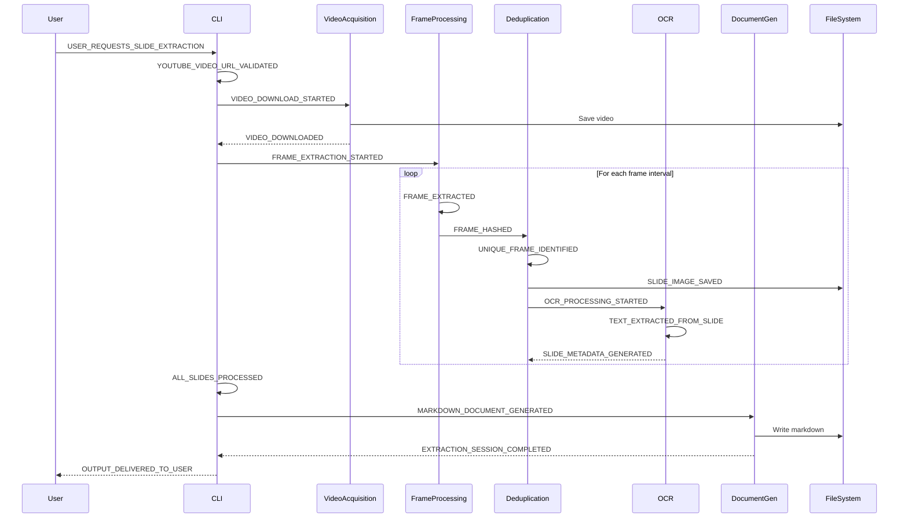
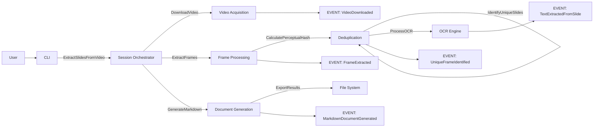
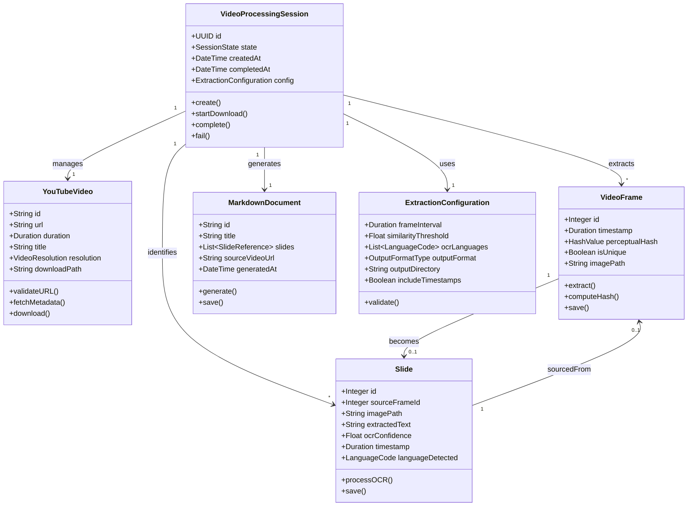
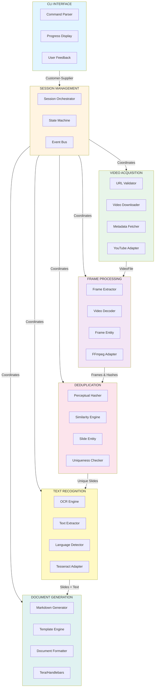
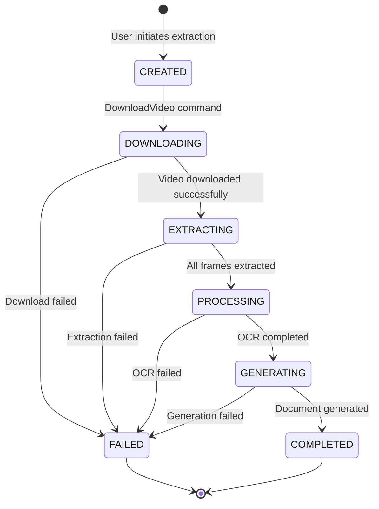
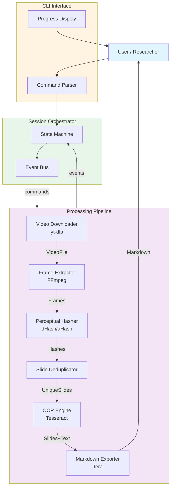

# EventStorming: YouTube Video Slide Extractor

> Domain-Driven Design specification for a CLI tool that extracts unique slides from YouTube videos with OCR and Markdown output.

---

## Table of Contents

1. [Quick Reference](#quick-reference)
2. [Domain Events](#domain-events)
3. [Commands](#commands)
4. [Actors](#actors)
5. [Domain Model](#domain-model)
6. [Bounded Contexts](#bounded-contexts)
7. [Fail Events](#fail-events)
8. [Testing Strategy](#testing-strategy)
9. [Implementation](#implementation)

---

## Quick Reference

### Core Flow
```
User Request → Download Video → Extract Frames → Hash & Deduplicate → OCR → Export Markdown
```

### State Machine
```
CREATED → DOWNLOADING → EXTRACTING → PROCESSING → GENERATING → COMPLETED/FAILED
```

### Key Entities
| Entity | Responsibility | ID Type |
|--------|----------------|---------|
| VideoProcessingSession | Orchestrates workflow | UUID |
| YouTubeVideo | Source video metadata | YouTube Video ID |
| VideoFrame | Extracted frame data | Frame Sequence |
| Slide | Unique identified slide | Slide Number |
| MarkdownDocument | Generated output | File Path |

### External Dependencies
- **yt-dlp**: Video downloading
- **FFmpeg**: Frame extraction
- **Tesseract**: OCR processing
- **Tera/Handlebars**: Markdown templating

---

## Domain Events

| Event | Trigger | Handler |
|-------|---------|---------|
| `VideoURLValidated` | CLI receives URL | URL Validator |
| `VideoDownloaded` | Download completes | Frame Extractor |
| `FrameExtracted` | Frame captured | Deduplication Engine |
| `UniqueFrameIdentified` | Slide determined unique | OCR Engine |
| `TextExtractedFromSlide` | OCR completes | Document Generator |
| `MarkdownDocumentGenerated` | Document created | File System |
| `ExtractionSessionCompleted` | All steps done | CLI |



---

## Commands

| Command | Trigger | Intent |
|---------|---------|--------|
| `ExtractSlidesFromVideo` | User initiates CLI | Extract unique slides from YouTube video |
| `DownloadVideo` | URL validated | Retrieve video content for processing |
| `ExtractFrames` | Video downloaded | Capture frames at specified intervals |
| `CalculatePerceptualHash` | Frame extracted | Generate fingerprint for deduplication |
| `IdentifyUniqueSlides` | Multiple frames hashed | Filter out duplicate slides |
| `ProcessOCR` | Unique slide identified | Extract text content from slide |
| `GenerateMarkdown` | All slides processed | Create structured output document |
| `ExportResults` | Markdown generated | Save output to filesystem |



---

## Actors

### Human Actors
- **Researcher** - Extracts slides for analysis
- **Student** - Captures lecture content
- **Content Creator** - Extracts source material
- **Educator** - Prepares teaching materials

### System Actors (Services)
- **VideoDownloaderService** - Downloads video from YouTube with retry logic
- **FrameExtractorService** - Captures frames at intervals, handles video decoding
- **DeduplicationEngine** - Computes perceptual hashes, identifies unique slides
- **OCREngine** - Extracts text from images, handles multiple languages
- **ExportService** - Formats and saves Markdown, manages file organization

---

## Domain Model

### Entity Relationships



### Entity Definitions

| Entity | ID Type | Lifecycle States | Key Attributes |
|--------|---------|------------------|----------------|
| **VideoProcessingSession** | UUID | CREATED → DOWNLOADING → EXTRACTING → PROCESSING → GENERATING → COMPLETED/FAILED | state, config, timestamps |
| **YouTubeVideo** | YouTube Video ID | METADATA_FETCHED → DOWNLOADED → DELETED | url, duration, title, resolution, downloadPath |
| **VideoFrame** | Frame Sequence | EXTRACTED → HASHED → FINALIZED | timestamp, perceptualHash, isUnique, imagePath |
| **Slide** | Slide Number | CREATED → OCR_COMPLETE → FINALIZED | imagePath, extractedText, ocrConfidence, timestamp |
| **MarkdownDocument** | File Path | GENERATED → WRITTEN | title, slides, sourceVideoUrl, generatedAt |

### Value Objects

| Value Object | Purpose |
|--------------|---------|
| **ExtractionConfiguration** | Encapsulates all extraction parameters (frameInterval, similarityThreshold, ocrLanguages, outputDirectory, etc.) |
| **HashValue** | Represents perceptual hash for deduplication |
| **LanguageCode** | ISO language code for OCR |
| **Duration** | Time duration for timestamps and intervals |

---

## Bounded Contexts

### Context Map



### Context Details

| Context | Language | Responsibility | Core Concepts | External Dependencies | ACL |
|---------|----------|-----------------|---------------|----------------------|-----|
| **CLI Interface** | Rust | User interaction, command parsing | CLICommand, UserArguments, ProgressDisplay, UserFeedback | clap, indicatif | CommandInterpreter |
| **Session Management** | Rust | Orchestration, state management, error handling | ProcessingSession, SessionState, SessionProgress, ExecutionContext | tokio, tracing | SessionOrchestrator |
| **Video Acquisition** | Rust | YouTube interaction, video downloading | VideoURL, VideoMetadata, DownloadRequest, VideoFile | yt-dlp, HTTP clients | YouTubeVideoAdapter |
| **Frame Processing** | Rust | Frame extraction, image processing | VideoStream, Frame, FrameTimestamp, ExtractionSettings | FFmpeg, imageproc | FFmpegAdapter |
| **Deduplication** | Rust | Slide identification, duplicate removal | PerceptualHash, HashSimilarity, UniquenessThreshold, SlideCandidate | image_hash | HashingEngine |
| **Text Recognition** | Rust | OCR processing, text extraction | SlideImage, ExtractedText, OCRConfidence, LanguageDetection | Tesseract, tesseract-rs | OCREngineAdapter |
| **Document Generation** | Rust | Output formatting, file management | MarkdownDocument, SlideSection, DocumentTemplate, OutputLocation | handlebars, tera | DocumentFormatter |

### Context Relationships

| Relationship | Type | Notes |
|--------------|------|-------|
| VIDEO ACQUISITION → FRAME PROCESSING | Upstream-Downstream | Partnership: FFmpeg required for both |
| FRAME PROCESSING → DEDUPLICATION | OHS | API: Hash-based frame comparison service |
| DEDUPLICATION → TEXT RECOGNITION | Customer-Supplier | ACL: Slide domain objects translation |
| TEXT RECOGNITION → DOCUMENT GENERATION | Upstream-Downstream | Shared Kernel: Slide data structure |
| SESSION MANAGEMENT ↔ ALL CONTEXTS | Coordinator | ACL: Domain events translation |
| CLI INTERFACE ↔ SESSION MANAGEMENT | Customer-Supplier | ACL: CLI commands to session operations |

---

## Fail Events

### Input Validation Failures

| Event | Conditions | Rule |
|-------|------------|------|
| `InvalidVideoURLProvided` | URL format incorrect, Video ID cannot be parsed | Must be valid youtube.com or youtu.be URL |
| `VideoUnavailable` | Video deleted, private, restricted, region restrictions | Video must be publicly accessible |
| `ConfigurationInvalid` | Frame interval < 1s, output directory not writable, similarity threshold out of range (0.0-1.0) | Configuration must satisfy all validation rules |

### Processing Failures

| Event | Conditions | Rule |
|-------|------------|------|
| `VideoDownloadFailed` | Network issues, YouTube API rate limits, insufficient disk space | Retry up to 3 times with exponential backoff |
| `FrameExtractionFailed` | Corrupted video file, unsupported codec, decoding errors | Log error and mark session as failed |
| `PerceptualHashComputationFailed` | Memory constraints, corrupted frame data | Skip frame and continue processing |
| `OCRProcessingFailed` | OCR engine unavailable, confidence below threshold, unsupported language | Extract slide without text, log warning |

### Output Failures

| Event | Conditions | Rule |
|-------|------------|------|
| `NoUniqueSlidesIdentified` | All frames are duplicates, no slide-like content detected | Provide error message, suggest adjusting frame interval |
| `MarkdownGenerationFailed` | File system permissions, invalid characters, template errors | Attempt fallback format, log detailed error |
| `OutputDirectoryNotWritable` | Insufficient permissions, disk space exhausted | Validate permissions before starting session |

### System Failures

| Event | Conditions | Rule |
|-------|------------|------|
| `InsufficientSystemResources` | Memory exhausted, CPU overloaded | Implement resource limits, graceful degradation |
| `NetworkTimeout` | Connection timeout exceeded | Implement retry logic with configurable timeout |
| `ExternalDependencyUnavailable` | Tesseract not installed, FFmpeg not available | Provide clear error messages with setup guide |

### Failure Mode Analysis

**Scenario: Video Download Fails Mid-Process**
- Detection: HTTP timeout, download callback
- Response: Preserve partial download for resume, retry with exponential backoff (max 3), notify user, cleanup on final failure

**Scenario: FFmpeg Not Available**
- Detection: Command execution failure
- Response: Check for FFmpeg in PATH on startup, provide installation instructions

**Scenario: Memory Exhaustion During Processing**
- Detection: Memory allocation failure
- Response: Implement streaming frame processing, set hard memory limits (2GB), provide warning for long videos (>1 hour)

**Scenario: Tesseract OCR Fails on All Slides**
- Detection: All OCR operations return empty or low confidence
- Response: Continue without text extraction, generate Markdown with images only, provide helpful error message

**Scenario: Duplicate Detection Produces Poor Results**
- Detection: User reports, too many/few unique slides
- Response: Make similarity threshold configurable, provide preview mode, offer multiple hashing algorithms

### Security & Compliance Measures

**Input Validation**
- Strict URL format validation (youtube.com, youtu.be only)
- Maximum video duration limit (configurable, default 4 hours)
- File size limits before processing
- Path traversal prevention in output directory

**Sandboxing**
- Download to temporary directory, validate before processing
- FFmpeg parameter whitelisting
- No network requests after initial download

**Data Privacy**
- All processing happens locally (no cloud uploads)
- Temporary files cleaned up on completion/failure
- No telemetry or analytics by default

**Copyright Compliance**
- Add disclaimer about fair use
- No redistribution features
- Optional watermark with source attribution

**Error Handling**
- Never expose file paths in error messages
- Sanitize user-provided paths
- Validate all external command arguments
- Implement timeouts for all external processes

---

## Testing Strategy

### Testing Pyramid

```
        E2E Tests (10%)
      Real YouTube Videos

       Integration Tests (30%)
   External Dependencies (FFmpeg, OCR)

       Unit Tests (60%)
   Domain Logic, Algorithms
```

### Acceptance Criteria

**Story 1: User extracts slides from a YouTube video**
- GIVEN a valid YouTube video URL
- AND the video contains presentation slides
- WHEN the user runs the extraction command
- THEN unique slides are extracted
- AND a Markdown document is generated
- AND all slides are embedded as images
- AND the document is saved to the specified output directory

**Story 2: User extracts text from slides via OCR**
- GIVEN extraction is configured with OCR enabled
- WHEN the OCR process completes
- THEN text content is extracted from each slide
- AND OCR confidence scores are calculated
- AND extracted text is included in the Markdown document
- AND slides with low confidence are marked

**Story 3: User customizes extraction parameters**
- GIVEN the user wants to adjust slide detection
- WHEN they specify custom frame interval
- AND they set a custom similarity threshold
- THEN extraction uses these parameters
- AND the results reflect the customization

**Story 4: System handles download failures gracefully**
- GIVEN a video URL that becomes unavailable
- WHEN the download fails
- THEN the system retries up to 3 times
- AND a clear error message is displayed
- AND partial files are cleaned up

**Story 5: System handles missing external dependencies**
- GIVEN FFmpeg is not installed on the system
- WHEN the user runs the extraction command
- THEN a helpful error message is displayed
- AND installation instructions are provided
- AND the application exits gracefully

### Test Cases

**Unit Tests**
- Video URL Validation: `src/video/url_validator.rs`
- Perceptual Hashing: `src/deduplication/hashing.rs`
- Slide Deduplication: `src/deduplication/engine.rs`
- Markdown Generation: `src/export/markdown.rs`
- Session State Machine: `src/session/state_machine.rs`

**Integration Tests**
- End-to-End Extraction: `tests/integration/e2e_extraction.rs`
- FFmpeg Integration: `tests/integration/ffmpeg.rs`
- Tesseract OCR Integration: `tests/integration/ocr.rs`
- External Command Execution: `tests/integration/process.rs`

**E2E Tests**
- Real Video Scenarios: `tests/e2e/real_videos.rs`
- Performance Tests: `tests/e2e/performance.rs`

**Edge Case Tests**
- Error Handling: `tests/edge_cases/errors.rs`

### Test Data Management

**Sample Videos**
- Short test video (2-3 min) with clear slides
- Medium test video (10-15 min) with various slide types
- Test video with animations/gradual changes
- Test video with text-only slides
- Test video with image-heavy slides
- Test video with mixed languages

**Sample Images**
- Known duplicate pairs for hash testing
- Slides with known OCR text
- Blank slides
- Slides with handwriting
- Slides with tables/charts

**Test Fixtures**
- Pre-configured extraction settings
- Mock YouTube video metadata responses
- Sample Markdown output templates

---

## Implementation

### Project Structure

```
yt-slide-extractor/
├── Cargo.toml
├── Cargo.lock
├── README.md
├── LICENSE
│
├── src/
│   ├── main.rs                    # CLI entry point
│   ├── lib.rs                     # Public API
│   │
│   ├── cli/                       # CLI Interface Context
│   │   ├── mod.rs
│   │   ├── commands.rs
│   │   ├── args.rs
│   │   └── progress.rs
│   │
│   ├── session/                   # Session Management Context
│   │   ├── mod.rs
│   │   ├── orchestrator.rs
│   │   ├── state.rs
│   │   ├── session.rs
│   │   └── events.rs
│   │
│   ├── video/                     # Video Acquisition Context
│   │   ├── mod.rs
│   │   ├── url_validator.rs
│   │   ├── downloader.rs
│   │   ├── metadata.rs
│   │   └── adapter.rs
│   │
│   ├── frames/                    # Frame Processing Context
│   │   ├── mod.rs
│   │   ├── extractor.rs
│   │   ├── decoder.rs
│   │   ├── frame.rs
│   │   └── ffmpeg_adapter.rs
│   │
│   ├── deduplication/             # Deduplication Context
│   │   ├── mod.rs
│   │   ├── hasher.rs
│   │   ├── engine.rs
│   │   ├── slide.rs
│   │   └── similarity.rs
│   │
│   ├── ocr/                       # Text Recognition Context
│   │   ├── mod.rs
│   │   ├── engine.rs
│   │   ├── text.rs
│   │   ├── language.rs
│   │   └── tesseract_adapter.rs
│   │
│   ├── export/                    # Document Generation Context
│   │   ├── mod.rs
│   │   ├── markdown.rs
│   │   ├── document.rs
│   │   ├── template.rs
│   │   └── formatter.rs
│   │
│   └── error/                     # Shared error handling
│       ├── mod.rs
│       └── result.rs
│
├── tests/
│   ├── integration/
│   ├── e2e/
│   └── edge_cases/
│
├── fixtures/                      # Test data
│   ├── videos/
│   ├── images/
│   └── configs/
│
├── docs/                          # Documentation
│   ├── architecture.md
│   ├── api.md
│   └── domain_model.md
│
└── scripts/                       # Utility scripts
    ├── setup.sh
    └── test.sh
```

### Key Dependencies

```toml
[dependencies]
clap = { version = "4.5", features = ["derive"] }       # CLI parsing
tokio = { version = "1.35", features = ["full"] }     # Async runtime
tracing = "0.1"                                       # Logging
tracing-subscriber = "0.3"                             # Log formatter
anyhow = "1.0"                                        # Error handling
thiserror = "1.0"                                     # Error types
image = "0.24"                                        # Image processing
imageproc = "0.23"                                    # Image algorithms
image_hasher = "1.2"                                  # Perceptual hash
tesseract-rs = "0.1"                                  # OCR binding
serde = { version = "1.0", features = ["derive"] }   # Serialization
serde_json = "1.0"                                    # JSON
tera = "1.19"                                         # Templating
indicatif = "0.17"                                    # Progress bars
console = "0.15"                                      # Terminal output
url = "2.5"                                           # URL parsing
chrono = "0.4"                                        # Date/time
uuid = { version = "1.6", features = ["v4", "serde"] }# UUIDs

[dev-dependencies]
tempfile = "3.8"                                       # Temp files
rstest = "0.18"                                       # Test fixtures
pretty_assertions = "1.4"                             # Test output
mockall = "0.11"                                      # Mocking
```

### Implementation Phases

| Phase | Duration | Deliverables |
|-------|----------|--------------|
| 1: Foundation | Week 1-2 | Project structure, CLI parsing, logging, error handling, URL validation, session state machine |
| 2: Video Processing | Week 3-4 | YouTube video download, FFmpeg frame extraction, frame entity, progress reporting |
| 3: Deduplication | Week 5-6 | Perceptual hashing, similarity calculation, slide entity, configurable threshold |
| 4: Text Recognition | Week 7-8 | Tesseract OCR integration, text extraction, confidence scoring, language detection |
| 5: Export & Formatting | Week 9-10 | Markdown generation, template system, image embedding, configurable output |
| 6: Polish & Robustness | Week 11-12 | Error handling, resource limits, performance optimization, retry logic |
| 7: Testing & Documentation | Week 13-14 | Unit/integration/E2E tests, user documentation, setup guide |
| 8: Release Preparation | Week 15-16 | Cross-platform builds, binary distribution, package managers, CI/CD |

### Development Guidelines

**Code Organization**
- Keep bounded contexts clearly separated
- Use Anti-Corruption Layers for external dependencies
- Domain logic in separate modules from infrastructure
- Prefer composition over inheritance

**Testing Approach**
- Write unit tests alongside code (TDD preferred)
- Mock external dependencies in unit tests
- Use integration tests for real external calls
- Property-based testing for algorithms

**Error Handling**
- Use Result<T, E> for recoverable errors
- Use anyhow::Error for application-level errors
- Define domain-specific error types with thiserror
- Never panic on user input errors

**Performance**
- Profile memory usage with valgrind/dhat
- Use streaming for large files
- Parallelize independent operations (Rayon)
- Benchmark critical paths (Criterion)

**Documentation**
- Document public API with rustdoc
- Include usage examples in documentation
- Maintain CHANGELOG.md for releases
- Document domain model decisions

### Success Metrics

**Functional Requirements**
- Extract unique slides from YouTube videos (95% accuracy)
- Generate Markdown with embedded images
- Extract text via OCR (80%+ accuracy on clear text)
- Handle videos up to 4 hours length
- Process at 1GB RAM maximum

**Quality Metrics**
- Test coverage > 80%
- Zero known critical bugs
- All integration tests passing
- E2E tests passing on sample videos

**Performance Metrics**
- < 5 minutes processing for 30-minute video
- < 10 minutes for 1-hour video
- Memory usage < 500MB during processing
- Startup time < 2 seconds

**User Experience Metrics**
- Clear error messages with actionable guidance
- Progress indicators for long operations
- Installation completes in < 5 minutes
- Zero manual configuration for basic usage

---

## Risk Register

| Category | Risk | Likelihood/Impact | Mitigation |
|----------|------|------------------|------------|
| Security | Malicious Video URLs | Medium/High | Validate URLs, sandbox downloads, size limits |
| Security | Arbitrary Code Execution | Low/High | Strict FFmpeg sanitization, whitelist params |
| Compliance | Copyright Violations | Medium/Medium | Add disclaimer, local-only processing |
| Compliance | GDPR/PII in Slides | Low/High | OCR redaction options, user consent prompts |
| Performance | Large Videos Exhaust RAM | High/High | Streaming extraction, chunk processing, resource limits |
| Performance | Slow OCR Processing | Medium/Medium | Async OCR, language hints, optional text extraction |
| Reliability | YouTube API Changes | Medium/Medium | yt-dlp with fallbacks, version pinning |
| Reliability | External Dep Failures (OCR/FFmpeg) | Medium/High | Graceful degrade, clear errors, setup docs |
| Usability | False Positives/Neg in Slides | Medium/Low | Configurable thresholds, visual preview |
| Usability | Poor OCR on Handwritten Slides | High/Medium | Language config, confidence scores, fallback options |

---

## Session State Machine



---

## System Architecture Overview



---

## Key Business Rules

1. Videos must be publicly accessible YouTube URLs
2. Slides must exceed similarity threshold to be considered unique
3. OCR text below confidence threshold is flagged
4. All temporary files are cleaned up on completion/failure
5. Output directory must be writable before processing starts

---

## Recommended Architecture

- Clean DDD with bounded contexts
- Anti-Corruption Layers for all external dependencies
- Async processing with tokio
- Resource limits and streaming for memory efficiency
- Comprehensive error handling with clear user feedback
