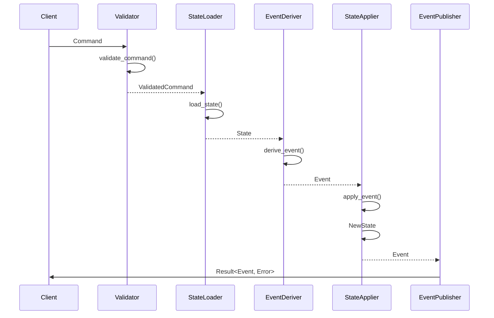
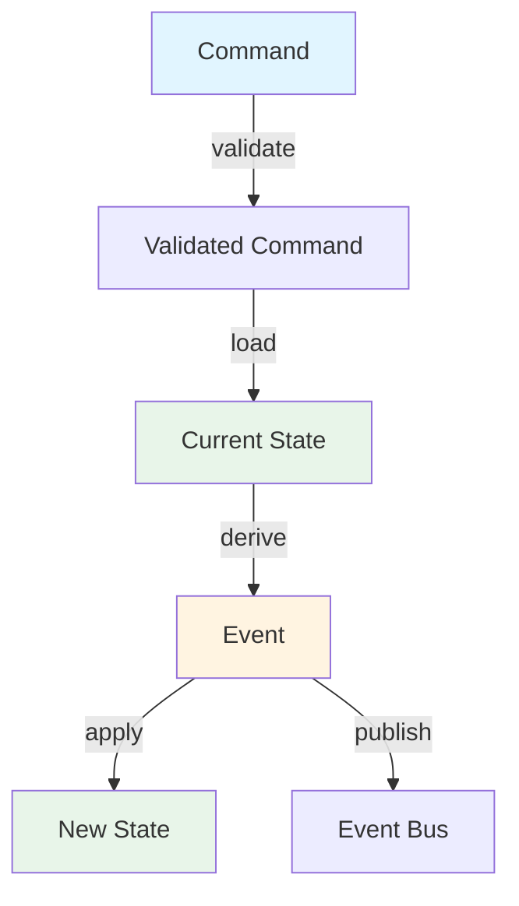
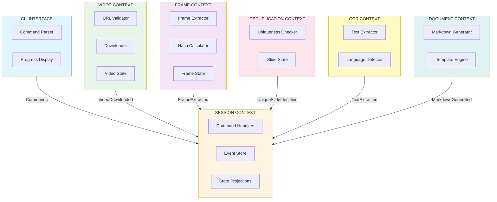

# Functional DDD: YouTube Video Slide Extractor

> Functional Domain-Driven Design specification for a CLI tool that extracts unique slides from YouTube videos with OCR and Markdown output.

---

## Table of Contents

1. [Quick Reference](#quick-reference)
2. [Functional DDD Principles](#functional-ddd-principles)
3. [Domain Events](#domain-events)
4. [Commands](#commands)
5. [Actors](#actors)
6. [Domain Model](#domain-model)
7. [Bounded Contexts](#bounded-contexts)
8. [Fail Events](#fail-events)
9. [Testing Strategy](#testing-strategy)
10. [Implementation](#implementation)

---

## Quick Reference

### Core Flow
```
User Request → Validate Command → Load State → Derive Event → Apply Event → Publish Event
```

### Command Handler Pattern
```rust
async fn handle_command(
    command: Command,
    state_loader: impl Fn(Id) -> State,
    event_applier: impl Fn(State, Event) -> State,
    event_publisher: impl Fn(Event),
) -> Result<Event, Error> {
    // 1. Validate command
    let validated = validate_command(command)?;

    // 2. Load current state
    let state = state_loader(validated.id())?;

    // 3. Derive event from command + state
    let event = derive_event(validated, state)?;

    // 4. Apply event to update state
    let new_state = event_applier(state, event.clone());

    // 5. Publish event
    event_publisher(event);

    Ok(event)
}
```

### Key Type Definitions
| Type | Purpose | Example |
|------|---------|---------|
| `Command` | Intent to change state | `ExtractSlidesFromVideo` |
| `Event` | Something that happened | `VideoDownloaded` |
| `State` | Current entity state | `VideoProcessingSession` |
| `Error` | Domain errors | `VideoUnavailable` |
| `Id<T>` | Typed identifier | `Id<VideoProcessingSession>` |

### External Dependencies
- **yt-dlp**: Video downloading
- **FFmpeg**: Frame extraction
- **Tesseract**: OCR processing
- **Tera**: Markdown templating

---

## Functional DDD Principles

### Core Concepts

**Data > Behavior**
- Entities are plain structs with data only
- Behavior implemented as pure functions
- No methods on domain objects

**Immutability**
- All domain types derive `Clone`
- State transitions create new values
- Use `&` references for read-only access

**Explicit State Transitions**
- Events are first-class citizens
- State changes via event application
- Event sourcing pattern by default

**Type-Driven Development**
- Strong typing for domain concepts
- Newtypes prevent primitive obsession
- Compile-time validation where possible

### Command Handler Lifecycle



### Error Handling Strategy

```rust
// Domain-specific error types
#[derive(Debug, thiserror::Error)]
pub enum ExtractionError {
    #[error("Invalid URL: {0}")]
    InvalidUrl(String),

    #[error("Video unavailable: {0}")]
    VideoUnavailable(Id<YouTubeVideo>),

    #[error("Download failed after {0} retries")]
    DownloadFailed(u8),

    #[error("OCR processing failed: {0}")]
    OcrFailed(String),
}

// Always use Result<T, E> for fallible operations
pub type DomainResult<T> = Result<T, ExtractionError>;
```

---

## Domain Events

### Event Types

| Event | Payload | When Emitted |
|-------|---------|--------------|
| `VideoUrlValidated` | `url: String`, `video_id: Id<YouTubeVideo>` | URL validated successfully |
| `VideoDownloaded` | `video_id: Id<YouTubeVideo>`, `path: PathBuf`, `duration: Duration` | Download completes |
| `FrameExtracted` | `session_id: Id<Session>`, `frame_number: u32`, `timestamp: Duration`, `hash: HashValue` | Frame captured |
| `UniqueSlideIdentified` | `slide_id: Id<Slide>`, `frame_id: Id<Frame>`, `image_path: PathBuf` | Slide determined unique |
| `TextExtracted` | `slide_id: Id<Slide>`, `text: String`, `confidence: f32`, `language: Language` | OCR completes |
| `SlideVerified` | `slide_id: Id<Slide>`, `is_slide: bool`, `reason: String` | LLM verification completes |
| `MarkdownGenerated` | `session_id: Id<Session>`, `path: PathBuf`, `slide_count: u32` | Document created |
| `SessionCompleted` | `session_id: Id<Session>`, `duration: Duration` | All steps done |

### Event Definition Pattern

```rust
#[derive(Debug, Clone, Serialize, Deserialize)]
pub enum ExtractionEvent {
    VideoUrlValidated(VideoUrlValidated),
    VideoDownloaded(VideoDownloaded),
    FrameExtracted(FrameExtracted),
    UniqueSlideIdentified(UniqueSlideIdentified),
    TextExtracted(TextExtracted),
    MarkdownGenerated(MarkdownGenerated),
    SessionCompleted(SessionCompleted),
}

#[derive(Debug, Clone, Serialize, Deserialize)]
pub struct VideoUrlValidated {
    pub url: String,
    pub video_id: Id<YouTubeVideo>,
}
```

### Event Flow



---

## Commands

### Command Types

| Command | Input | Output | Side Effects |
|---------|-------|--------|--------------|
| `ExtractSlidesFromVideo` | `url: String`, `config: ExtractionConfig` | `SessionStarted` | Creates session |
| `DownloadVideo` | `video_id: Id<YouTubeVideo>` | `VideoDownloaded` | Saves video file |
| `ExtractFrame` | `session_id: Id<Session>`, `timestamp: Duration` | `FrameExtracted` | Captures frame |
| `IdentifyUniqueSlide` | `frame_hashes: Vec<(Id<Frame>, HashValue)>` | `Vec<UniqueSlideIdentified>` | Saves slide images |
| `ExtractText` | `slide_id: Id<Slide>` | `TextExtracted` | Runs OCR |
| `VerifySlide` | `slide_id: Id<Slide>`, `image_path: PathBuf`, `config: LlmConfig` | `SlideVerified` | Runs Cloud LLM verification |
| `GenerateMarkdown` | `session_id: Id<Session>` | `MarkdownGenerated` | Writes file |

### Command Definition Pattern

```rust
#[derive(Debug, Clone, Serialize, Deserialize)]
pub enum ExtractionCommand {
    ExtractSlidesFromVideo(ExtractSlidesFromVideoCommand),
    DownloadVideo(DownloadVideoCommand),
    ExtractFrame(ExtractFrameCommand),
    IdentifyUniqueSlide(IdentifyUniqueSlideCommand),
    ExtractText(ExtractTextCommand),
    GenerateMarkdown(GenerateMarkdownCommand),
}

#[derive(Debug, Clone, Serialize, Deserialize)]
pub struct ExtractSlidesFromVideoCommand {
    pub url: String,
    pub config: ExtractionConfig,
}
```

### Command Handler Example

```rust
pub async fn handle_download_video(
    command: DownloadVideoCommand,
    downloader: &VideoDownloader,
) -> DomainResult<VideoDownloaded> {
    // Validate
    let video_id = validate_youtube_url(&command.url)?;

    // Execute side effect
    let (path, duration) = downloader.download(&video_id).await?;

    // Return event
    Ok(VideoDownloaded {
        video_id,
        path,
        duration,
    })
}
```

---

## Actors

### Human Actors
- **Researcher** - Extracts slides for analysis
- **Student** - Captures lecture content
- **Content Creator** - Extracts source material
- **Educator** - Prepares teaching materials

### System Actors (Pure Functions)

| Actor | Type | Responsibility |
|-------|------|----------------|
| `validate_video_url` | `fn(String) -> Result<Id<Video>, Error>` | URL validation |
| `download_video` | `async fn(Id<Video>) -> Result<VideoFile, Error>` | Video download |
| `extract_frame` | `async fn(VideoFile, Duration) -> Result<Frame, Error>` | Frame extraction |
| `compute_hash` | `fn(&Image) -> HashValue` | Perceptual hashing |
| `is_unique_slide` | `fn(HashValue, &HashSet<HashValue>) -> bool` | Deduplication |
| `extract_text` | `async fn(&Image) -> Result<String, Error>` | OCR processing |
| `verify_slide` | `async fn(&Image, LlmConfig) -> Result<bool, Error>` | LLM verification |
| `generate_markdown` | `fn(Vec<Slide>) -> String` | Document generation |

---

## Domain Model

### Newtype Pattern for IDs

```rust
#[derive(Debug, Clone, Copy, PartialEq, Eq, Hash, Serialize, Deserialize)]
pub struct Id<T>(Uuid);

impl<T> Id<T> {
    pub fn new() -> Self { Self(Uuid::new_v4()) }
    pub fn from_uuid(uuid: Uuid) -> Self { Self(uuid) }
    pub fn as_uuid(&self) -> Uuid { self.0 }
}

// Usage
type SessionId = Id<VideoProcessingSession>;
type VideoId = Id<YouTubeVideo>;
type SlideId = Id<Slide>;
```

### Domain Types (Plain Structs)

```rust
#[derive(Debug, Clone, Serialize, Deserialize)]
pub struct VideoProcessingSession {
    pub id: Id<VideoProcessingSession>,
    pub video_id: Id<YouTubeVideo>,
    pub state: SessionState,
    pub config: ExtractionConfig,
    pub created_at: DateTime<Utc>,
    pub completed_at: Option<DateTime<Utc>>,
}

#[derive(Debug, Clone, Serialize, Deserialize)]
pub enum SessionState {
    Created,
    Downloading,
    Extracting,
    Processing,
    Generating,
    Completed,
    Failed(String),
}

#[derive(Debug, Clone, Serialize, Deserialize)]
pub struct YouTubeVideo {
    pub id: Id<YouTubeVideo>,
    pub url: String,
    pub title: String,
    pub duration: Duration,
    pub resolution: VideoResolution,
}

#[derive(Debug, Clone, Serialize, Deserialize)]
pub struct VideoFrame {
    pub id: Id<VideoFrame>,
    pub session_id: Id<VideoProcessingSession>,
    pub timestamp: Duration,
    pub hash: HashValue,
    pub image_path: PathBuf,
}

#[derive(Debug, Clone, Serialize, Deserialize)]
pub struct Slide {
    pub id: Id<Slide>,
    pub session_id: Id<VideoProcessingSession>,
    pub source_frame_id: Id<VideoFrame>,
    pub image_path: PathBuf,
    pub extracted_text: Option<String>,
    pub ocr_confidence: Option<f32>,
    pub language: Option<Language>,
    pub requires_human_review: bool,
}

#[derive(Debug, Clone, Serialize, Deserialize)]
pub struct LlmConfig {
    pub api_key: String,
    pub base_url: String,
    pub model: String,
}

#[derive(Debug, Clone, Serialize, Deserialize)]
pub struct ExtractionConfig {
    pub frame_interval: Duration,
    pub similarity_threshold: f32,
    pub ocr_languages: Vec<Language>,
    pub output_directory: PathBuf,
    pub include_timestamps: bool,
}
```

### Value Objects

```rust
#[derive(Debug, Clone, PartialEq, Eq, Hash, Serialize, Deserialize)]
pub struct HashValue(Vec<u8>);

impl HashValue {
    pub fn new(bytes: Vec<u8>) -> Self { Self(bytes) }
    pub fn similarity(&self, other: &Self) -> f32 { /* ... */ }
}

#[derive(Debug, Clone, Serialize, Deserialize)]
pub struct VideoResolution {
    pub width: u32,
    pub height: u32,
}

#[derive(Debug, Clone, Copy, Serialize, Deserialize)]
pub enum Language {
    English,
    Spanish,
    French,
    German,
    Japanese,
    Chinese,
    Korean,
}
```

### State Transition Functions

```rust
// Apply event to state
pub fn apply_event(state: VideoProcessingSession, event: ExtractionEvent) -> VideoProcessingSession {
    match event {
        ExtractionEvent::VideoDownloaded(_) => VideoProcessingSession {
            state: SessionState::Extracting,
            ..state
        },
        ExtractionEvent::MarkdownGenerated(_) => VideoProcessingSession {
            state: SessionState::Completed,
            completed_at: Some(Utc::now()),
            ..state
        },
        ExtractionEvent::SessionFailed(reason) => VideoProcessingSession {
            state: SessionState::Failed(reason),
            completed_at: Some(Utc::now()),
            ..state
        },
        _ => state,
    }
}
```

---

## Bounded Contexts

### Context Map



### Context Implementation Pattern

Each bounded context follows this structure:

```
contexts/
└── session/
    ├── domain/
    │   ├── commands.rs      // Command types
    │   ├── events.rs        // Event types
    │   ├── state.rs         // State types
    │   ├── handlers.rs      // Pure handler functions
    │   └── policies.rs      // Business rules
    ├── application/
    │   ├── service.rs       // Service coordination
    │   └── bus.rs           // Event bus
    └── infrastructure/
        ├── repository.rs    // State persistence
        └── publisher.rs     // Event publishing
```

### Context Details

| Context | Responsibility | Core Types | External Deps |
|---------|----------------|------------|---------------|
| **CLI Interface** | User interaction | `CliCommand`, `UserArguments` | clap, indicatif |
| **Session** | Orchestration | `Session`, `SessionState`, `ExtractionEvent` | tokio, tracing |
| **Video** | YouTube interaction | `YouTubeVideo`, `VideoURL`, `VideoFile` | yt-dlp, HTTP |
| **Frame** | Frame extraction | `VideoFrame`, `VideoStream`, `FrameTimestamp` | FFmpeg, image |
| **Deduplication** | Slide identification | `Slide`, `HashValue`, `Similarity` | image_hash |
| **OCR** | Text recognition | `Slide`, `ExtractedText`, `OCRConfidence` | Tesseract |
| **Document** | Output formatting | `MarkdownDocument`, `DocumentTemplate` | tera |

---

## Fail Events

### Error Types

```rust
#[derive(Debug, thiserror::Error)]
pub enum ExtractionError {
    // Input validation
    #[error("Invalid YouTube URL: {0}")]
    InvalidUrl(String),

    #[error("Video ID '{0}' is unavailable")]
    VideoUnavailable(Id<YouTubeVideo>),

    #[error("Invalid configuration: {0}")]
    InvalidConfig(String),

    // Processing failures
    #[error("Download failed after {0} retries: {1}")]
    DownloadFailed(u8, String),

    #[error("Frame extraction failed: {0}")]
    FrameExtractionFailed(String),

    #[error("Hash computation failed for frame {0}")]
    HashComputationFailed(Id<VideoFrame>),

    #[error("OCR failed for slide {0}: {1}")]
    OcrFailed(Id<Slide>, String),

    #[error("Markdown generation failed: {0}")]
    MarkdownGenerationFailed(String),

    // Output failures
    #[error("No unique slides found")]
    NoUniqueSlidesFound,

    #[error("Output directory not writable: {0}")]
    OutputDirectoryNotWritable(PathBuf),

    // System failures
    #[error("Insufficient memory: required {0}MB")]
    InsufficientMemory(u64),

    #[error("Network timeout after {0:?}")]
    NetworkTimeout(Duration),

    #[error("External dependency unavailable: {0}")]
    ExternalDependencyUnavailable(String),
}
```

### Error Handling Strategy

```rust
// Use Result for fallible operations
pub fn validate_url(url: &str) -> Result<Id<YouTubeVideo>, ExtractionError> {
    if !url.starts_with("https://www.youtube.com/") && !url.starts_with("https://youtu.be/") {
        return Err(ExtractionError::InvalidUrl(url.to_string()));
    }

    // Extract video ID logic...
    Ok(Id::from_uuid(Uuid::new_v4()))
}

// Recoverable errors with retry
pub async fn download_with_retry(
    downloader: &VideoDownloader,
    video_id: Id<YouTubeVideo>,
    max_retries: u8,
) -> Result<VideoFile, ExtractionError> {
    let mut last_error = None;

    for attempt in 1..=max_retries {
        match downloader.download(&video_id).await {
            Ok(file) => return Ok(file),
            Err(e) => {
                last_error = Some(e);
                tokio::time::sleep(Duration::from_secs(2_u64.pow(attempt.into()))).await;
            }
        }
    }

    Err(ExtractionError::DownloadFailed(max_retries, last_error.unwrap().to_string()))
}
```

---

## Testing Strategy

### Testing Pyramid

```
        Property Tests (20%)
    Invariant preservation

        Unit Tests (50%)
    Pure functions, handlers

    Integration Tests (30%)
    External dependencies
```

### Property-Based Testing

```rust
use proptest::prelude::*;

proptest! {
    #[test]
    fn test_hash_deterministic(img_data in prop::collection::vec(any::<u8>(), 0..10000)) {
        let hash1 = compute_hash(&img_data);
        let hash2 = compute_hash(&img_data);
        assert_eq!(hash1, hash2);
    }

    #[test]
    fn test_similarity_symmetric(hash1_vec in prop::collection::vec(any::<u8>(), 64),
                                  hash2_vec in prop::collection::vec(any::<u8>(), 64)) {
        let hash1 = HashValue(hash1_vec);
        let hash2 = HashValue(hash2_vec);
        let sim1 = hash1.similarity(&hash2);
        let sim2 = hash2.similarity(&hash1);
        assert!((sim1 - sim2).abs() < f32::EPSILON);
    }
}
```

### Unit Test Pattern

```rust
#[cfg(test)]
mod tests {
    use super::*;
    use crate::domain::test_fixtures::*;

    #[test]
    fn test_validate_valid_url() {
        let url = "https://www.youtube.com/watch?v=dQw4w9WgXcQ";
        let result = validate_url(url);
        assert!(result.is_ok());
    }

    #[test]
    fn test_validate_invalid_url() {
        let url = "https://example.com/video";
        let result = validate_url(url);
        assert!(matches!(result, Err(ExtractionError::InvalidUrl(_))));
    }

    #[test]
    fn test_deduplication_removes_duplicates() {
        let hashes = vec![
            HashValue(vec![1, 2, 3]),
            HashValue(vec![1, 2, 3]), // Duplicate
            HashValue(vec![4, 5, 6]),
        ];
        let unique = find_unique_slides(&hashes, 1.0);
        assert_eq!(unique.len(), 2);
    }
}
```

---

## Implementation

## Feature List (FDD)

### Video Acquisition Feature Set
- Validate YouTube URL
- Fetch video metadata
- Download video file with retry logic

### Frame Processing Feature Set
- Extract frames at regular intervals
- Compute perceptual hash for each frame

### Deduplication Feature Set
- Compare frames using similarity threshold
- Identify unique slide candidates
- [NEW] Verify slide content using Cloud LLM
- [NEW] Tag non-slide frames for human review

### OCR Feature Set
- Extract text from slide images
- Detect slide language
- Filter results by confidence threshold

### Document Generation Feature Set
- Format slide content as Markdown
- Embed slide images and timestamps
- [NEW] Ask for deletion of human-review tagged slides

### Session & CLI Feature Set
- Orchestrate end-to-end pipeline
- Display real-time progress
- Handle session recovery
- [NEW] Prompt for conditional cleanup of tagged frames

---

## References


Inspired by:
- Functional DDD patterns from PensionBee ddd-workshop
- Scott Wlaschin's "Domain Modeling Made Functional"
- Event sourcing patterns
- Rust's ownership and type system for domain modeling
