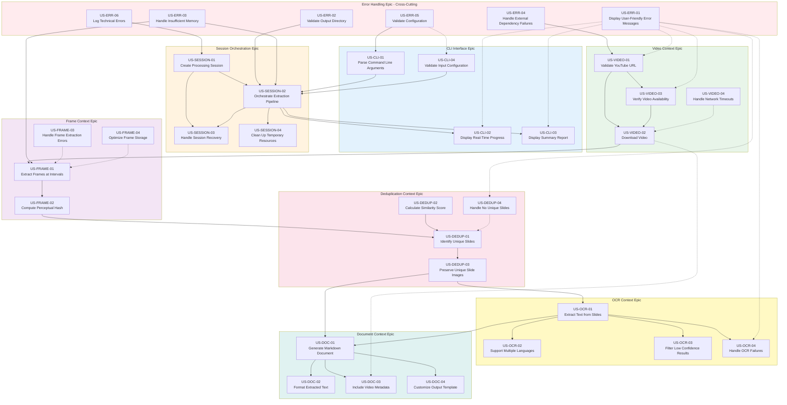

# Dependency Analysis: YouTube Video Slide Extractor User Stories

> Analysis of dependencies between user stories to guide implementation planning and sequencing.

---

## Table of Contents

1. [Executive Summary](#executive-summary)
2. [Dependency Matrix](#dependency-matrix)
3. [Dependency Graph](#dependency-graph)
4. [Critical Path Analysis](#critical-path-analysis)
5. [Independent Stories for Parallel Work](#independent-stories-for-parallel-work)
6. [Cross-Epic Dependencies](#cross-epic-dependencies)
7. [Implementation Waves](#implementation-waves)
8. [Circular Dependencies](#circular-dependencies)
9. [Recommendations](#recommendations)

---

## Executive Summary

This document analyzes the dependencies between 26 user stories across 8 epics for the YouTube Video Slide Extractor project. The analysis reveals:

- **Total User Stories**: 26
- **Hard Dependencies**: 22 direct hard dependencies
- **Soft Dependencies**: 8 beneficial sequencing relationships
- **Critical Path Length**: 12 stories (longest chain)
- **Parallelizable Stories**: 8 stories can be implemented in parallel

### Key Findings

1. **Error Handling Epic** stories are mostly cross-cutting and can be implemented early
2. **Session Orchestration Epic** is the central coordinator and has the most dependencies
3. **Video → Frame → Deduplication → OCR → Document** forms the core processing pipeline
4. **CLI Interface Epic** stories depend on the underlying domain contexts being functional

---

## Dependency Matrix

### Legend

| Symbol | Meaning |
|--------|---------|
| **→** | Hard dependency (must complete before) |
| **→̃** | Soft dependency (beneficial to complete before) |
| **N/A** | No dependencies |
| **⚠** | Circular dependency detected |

### Matrix by User Story

| User Story | Hard Dependencies | Soft Dependencies | Depended On By |
|------------|-------------------|-------------------|----------------|
| **US-CLI-01** Parse Command Line Arguments | N/A | US-ERR-05 | US-SESSION-02, US-ERR-05 |
| **US-CLI-02** Display Real-Time Progress | US-SESSION-02 | US-ERR-01 | N/A |
| **US-CLI-03** Display Summary Report | US-SESSION-02 | US-ERR-01 | N/A |
| **US-CLI-04** Validate Input Configuration | N/A | US-ERR-05 | US-SESSION-02 |
| **US-SESSION-01** Create Processing Session | N/A | US-ERR-06 | US-SESSION-02, US-SESSION-03 |
| **US-SESSION-02** Orchestrate Extraction Pipeline | US-CLI-01, US-CLI-04, US-SESSION-01, US-VIDEO-01, US-VIDEO-02, US-FRAME-01, US-DEDUP-01, US-OCR-01, US-DOC-01 | US-ERR-01, US-ERR-02, US-ERR-03, US-ERR-04 | US-CLI-02, US-CLI-03, US-SESSION-03, US-SESSION-04 |
| **US-SESSION-03** Handle Session Recovery | US-SESSION-01, US-SESSION-02 | N/A | N/A |
| **US-SESSION-04** Clean Up Temporary Resources | US-SESSION-02 | N/A | N/A |
| **US-VIDEO-01** Validate YouTube URL | N/A | US-ERR-01, US-ERR-04 | US-VIDEO-02, US-VIDEO-03, US-SESSION-02 |
| **US-VIDEO-02** Download Video | US-VIDEO-01, US-VIDEO-03 | US-VIDEO-04 | US-FRAME-01, US-SESSION-02 |
| **US-VIDEO-03** Verify Video Availability | N/A | US-ERR-01, US-ERR-04 | US-VIDEO-02 |
| **US-VIDEO-04** Handle Network Timeouts | N/A | US-VIDEO-02 | N/A |
| **US-FRAME-01** Extract Frames at Intervals | US-VIDEO-02 | US-ERR-03 | US-FRAME-02, US-SESSION-02 |
| **US-FRAME-02** Compute Perceptual Hash | US-FRAME-01 | N/A | US-DEDUP-01 |
| **US-FRAME-03** Handle Frame Extraction Errors | N/A | US-FRAME-01, US-ERR-01 | N/A |
| **US-FRAME-04** Optimize Frame Storage | N/A | US-FRAME-01 | N/A |
| **US-DEDUP-01** Identify Unique Slides | US-FRAME-02, US-DEDUP-02 | N/A | US-DEDUP-03, US-DEDUP-04, US-SESSION-02 |
| **US-DEDUP-02** Calculate Similarity Score | N/A | N/A | US-DEDUP-01 |
| **US-DEDUP-03** Preserve Unique Slide Images | US-DEDUP-01 | N/A | US-OCR-01, US-DOC-01 |
| **US-DEDUP-04** Handle No Unique Slides | N/A | US-DEDUP-01, US-ERR-01 | N/A |
| **US-OCR-01** Extract Text from Slides | US-DEDUP-03 | N/A | US-OCR-02, US-OCR-03, US-OCR-04, US-DOC-01, US-SESSION-02 |
| **US-OCR-02** Support Multiple Languages | US-OCR-01 | N/A | N/A |
| **US-OCR-03** Filter Low Confidence Results | US-OCR-01 | N/A | N/A |
| **US-OCR-04** Handle OCR Failures | US-OCR-01 | US-ERR-01 | N/A |
| **US-DOC-01** Generate Markdown Document | US-OCR-01, US-DEDUP-03 | N/A | US-DOC-02, US-DOC-03, US-DOC-04, US-SESSION-02 |
| **US-DOC-02** Format Extracted Text | US-DOC-01 | N/A | N/A |
| **US-DOC-03** Include Video Metadata | US-DOC-01 | US-VIDEO-02 | N/A |
| **US-DOC-04** Customize Output Template | US-DOC-01 | N/A | N/A |
| **US-ERR-01** Display User-Friendly Error Messages | N/A | N/A | US-CLI-02, US-CLI-03, US-VIDEO-01, US-VIDEO-03, US-DEDUP-04, US-OCR-04 |
| **US-ERR-02** Validate Output Directory | N/A | N/A | US-SESSION-02 |
| **US-ERR-03** Handle Insufficient Memory | N/A | N/A | US-SESSION-02, US-FRAME-01 |
| **US-ERR-04** Handle External Dependency Failures | N/A | N/A | US-VIDEO-01, US-VIDEO-03 |
| **US-ERR-05** Validate Configuration | N/A | N/A | US-CLI-01, US-CLI-04 |
| **US-ERR-06** Log Technical Errors | N/A | N/A | US-SESSION-01 |

---

## Dependency Graph



---

## Critical Path Analysis

The critical path represents the longest chain of dependent user stories that must be completed sequentially. This path determines the minimum time required to deliver a working end-to-end solution.

### Primary Critical Path

```
US-ERR-05 → US-CLI-01 → US-SESSION-01 → US-VIDEO-01 → US-VIDEO-03 → US-VIDEO-02
→ US-FRAME-01 → US-FRAME-02 → US-DEDUP-02 → US-DEDUP-01 → US-DEDUP-03
→ US-OCR-01 → US-DOC-01 → US-SESSION-02
```

**Length: 15 stories**

### Critical Path Breakdown

| Step | User Story | Epic | Notes |
|------|------------|------|-------|
| 1 | US-ERR-05 | Error Handling | Configuration validation foundation |
| 2 | US-CLI-01 | CLI | Parse command line arguments |
| 3 | US-SESSION-01 | Session | Create processing session |
| 4 | US-VIDEO-01 | Video | Validate YouTube URL |
| 5 | US-VIDEO-03 | Video | Verify video availability |
| 6 | US-VIDEO-02 | Video | Download video |
| 7 | US-FRAME-01 | Frame | Extract frames at intervals |
| 8 | US-FRAME-02 | Frame | Compute perceptual hash |
| 9 | US-DEDUP-02 | Deduplication | Calculate similarity score |
| 10 | US-DEDUP-01 | Deduplication | Identify unique slides |
| 11 | US-DEDUP-03 | Deduplication | Preserve unique slide images |
| 12 | US-OCR-01 | OCR | Extract text from slides |
| 13 | US-DOC-01 | Document | Generate Markdown document |
| 14 | US-SESSION-02 | Session | Orchestrate extraction pipeline |

### Secondary Critical Paths

1. **Session Recovery Path**: US-SESSION-02 → US-SESSION-03
2. **Cleanup Path**: US-SESSION-02 → US-SESSION-04
3. **Progress Display Path**: US-SESSION-02 → US-CLI-02
4. **Summary Report Path**: US-SESSION-02 → US-CLI-03

### Critical Path Bottlenecks

| Bottleneck | Affected Stories | Impact |
|------------|------------------|--------|
| US-SESSION-02 | US-CLI-02, US-CLI-03, US-SESSION-03, US-SESSION-04 | Blocks all CLI display and session management features |
| US-VIDEO-02 | US-FRAME-01, US-SESSION-02 | Blocks entire frame extraction pipeline |
| US-DEDUP-03 | US-OCR-01, US-DOC-01 | Blocks OCR and document generation |
| US-OCR-01 | US-DOC-01, US-SESSION-02 | Blocks document generation and pipeline completion |

---

## Independent Stories for Parallel Work

The following user stories have minimal or no dependencies and can be implemented in parallel with other stories:

### Fully Independent (No Hard Dependencies)

| User Story | Epic | Can Parallel With |
|------------|------|------------------|
| US-ERR-01 | Error Handling | All stories |
| US-ERR-02 | Error Handling | All stories |
| US-ERR-03 | Error Handling | All stories |
| US-ERR-04 | Error Handling | All stories |
| US-ERR-06 | Error Handling | All stories |
| US-VIDEO-04 | Video | All stories except US-VIDEO-02 (soft) |
| US-FRAME-03 | Frame | All stories except US-FRAME-01 (soft) |
| US-FRAME-04 | Frame | All stories except US-FRAME-01 (soft) |
| US-DEDUP-02 | Deduplication | All stories except US-DEDUP-01 |
| US-DEDUP-04 | Deduplication | All stories except US-DEDUP-01 (soft) |
| US-OCR-02 | OCR | All stories except US-OCR-01 |
| US-OCR-03 | OCR | All stories except US-OCR-01 |
| US-OCR-04 | OCR | All stories except US-OCR-01 |
| US-DOC-02 | Document | All stories except US-DOC-01 |
| US-DOC-03 | Document | All stories except US-DOC-01 |
| US-DOC-04 | Document | All stories except US-DOC-01 |

### Parallel Implementation Groups

**Group A: Cross-Cutting Infrastructure (can start immediately)**
- US-ERR-01, US-ERR-02, US-ERR-03, US-ERR-04, US-ERR-05, US-ERR-06

**Group B: Video Context Infrastructure (after Group A)**
- US-VIDEO-01, US-VIDEO-03, US-VIDEO-04

**Group C: Frame Context Infrastructure (after US-VIDEO-02)**
- US-FRAME-03, US-FRAME-04

**Group D: Deduplication Infrastructure (after US-FRAME-02)**
- US-DEDUP-02, US-DEDUP-04

**Group E: OCR Infrastructure (after US-OCR-01)**
- US-OCR-02, US-OCR-03, US-OCR-04

**Group F: Document Infrastructure (after US-DOC-01)**
- US-DOC-02, US-DOC-03, US-DOC-04

---

## Cross-Epic Dependencies

### Dependency Summary by Epic

| From Epic | To Epic | Dependency Type | Count |
|-----------|---------|-----------------|-------|
| Error Handling | CLI | Hard | 1 |
| Error Handling | Session | Hard | 2 |
| Error Handling | Video | Hard | 2 |
| Error Handling | Frame | Hard | 1 |
| CLI | Session | Hard | 2 |
| Session | CLI | Hard | 2 |
| Session | Session | Hard | 2 |
| Video | Frame | Hard | 1 |
| Video | Document | Soft | 1 |
| Frame | Deduplication | Hard | 1 |
| Deduplication | OCR | Hard | 1 |
| Deduplication | Document | Hard | 1 |
| OCR | Document | Hard | 1 |

### Detailed Cross-Epic Dependencies

#### Error Handling → All Epics

The Error Handling Epic provides cross-cutting concerns that must be available early:

- **US-ERR-05** → US-CLI-01, US-CLI-04 (Configuration validation)
- **US-ERR-06** → US-SESSION-01 (Logging foundation)
- **US-ERR-04** → US-VIDEO-01, US-VIDEO-03 (External dependency checks)
- **US-ERR-02** → US-SESSION-02 (Output directory validation)
- **US-ERR-03** → US-SESSION-02, US-FRAME-01 (Memory handling)

#### CLI ↔ Session (Bidirectional)

- **US-CLI-01, US-CLI-04** → US-SESSION-02 (Configuration input)
- **US-SESSION-02** → US-CLI-02, US-CLI-03 (Progress/summary display)

#### Video → Frame → Deduplication → OCR → Document (Pipeline Flow)

This is the core processing pipeline with clear sequential dependencies:

1. **Video → Frame**: US-VIDEO-02 → US-FRAME-01
2. **Frame → Deduplication**: US-FRAME-02 → US-DEDUP-01
3. **Deduplication → OCR**: US-DEDUP-03 → US-OCR-01
4. **Deduplication → Document**: US-DEDUP-03 → US-DOC-01
5. **OCR → Document**: US-OCR-01 → US-DOC-01

#### Session → All Contexts (Orchestration)

**US-SESSION-02** depends on all context epics to orchestrate the pipeline:
- US-VIDEO-01, US-VIDEO-02
- US-FRAME-01
- US-DEDUP-01
- US-OCR-01
- US-DOC-01

### Shared Dependencies

Multiple stories depend on these foundation stories:

| Foundation Story | Dependent Stories | Count |
|------------------|-------------------|-------|
| US-VIDEO-01 | US-VIDEO-02, US-VIDEO-03, US-SESSION-02 | 3 |
| US-VIDEO-02 | US-FRAME-01, US-SESSION-02 | 2 |
| US-FRAME-01 | US-FRAME-02, US-SESSION-02 | 2 |
| US-FRAME-02 | US-DEDUP-01 | 1 |
| US-DEDUP-01 | US-DEDUP-03, US-DEDUP-04, US-SESSION-02 | 3 |
| US-DEDUP-03 | US-OCR-01, US-DOC-01 | 2 |
| US-OCR-01 | US-OCR-02, US-OCR-03, US-OCR-04, US-DOC-01, US-SESSION-02 | 5 |
| US-DOC-01 | US-DOC-02, US-DOC-03, US-DOC-04, US-SESSION-02 | 4 |
| US-SESSION-02 | US-CLI-02, US-CLI-03, US-SESSION-03, US-SESSION-04 | 4 |

---

## Implementation Waves

Based on the dependency analysis, the following implementation waves are recommended:

### Wave 1: Foundation & Infrastructure (Week 1-2)

**Goal**: Establish cross-cutting concerns and basic infrastructure

| Priority | User Story | Epic | Notes |
|----------|------------|------|-------|
| 1 | US-ERR-05 | Error Handling | Configuration validation |
| 2 | US-ERR-06 | Error Handling | Logging infrastructure |
| 3 | US-ERR-01 | Error Handling | User-friendly error messages |
| 4 | US-ERR-04 | Error Handling | External dependency checks |
| 5 | US-ERR-02 | Error Handling | Output directory validation |
| 6 | US-ERR-03 | Error Handling | Memory handling |
| 7 | US-CLI-01 | CLI | Command line parsing |
| 8 | US-CLI-04 | CLI | Input configuration validation |
| 9 | US-SESSION-01 | Session | Session creation and state |

**Deliverables**:
- Error handling framework
- Configuration validation system
- Basic session management
- Command line argument parsing

**Parallel Opportunities**:
- Error handling stories (US-ERR-01 through US-ERR-06) can be done in parallel
- US-CLI-01 and US-CLI-04 can be done in parallel with error handling

---

### Wave 2: Video Context (Week 3)

**Goal**: Enable video downloading and validation

| Priority | User Story | Epic | Notes |
|----------|------------|------|-------|
| 1 | US-VIDEO-01 | Video | URL validation |
| 2 | US-VIDEO-03 | Video | Video availability check |
| 3 | US-VIDEO-04 | Video | Network timeout handling |
| 4 | US-VIDEO-02 | Video | Video download |

**Deliverables**:
- YouTube URL validation
- Video availability verification
- Video download with retry logic
- Network timeout handling

**Parallel Opportunities**:
- US-VIDEO-01, US-VIDEO-03, US-VIDEO-04 can be started in parallel
- US-VIDEO-02 must wait for US-VIDEO-01 and US-VIDEO-03

---

### Wave 3: Frame Context (Week 4)

**Goal**: Extract frames from downloaded videos

| Priority | User Story | Epic | Notes |
|----------|------------|------|-------|
| 1 | US-FRAME-01 | Frame | Frame extraction |
| 2 | US-FRAME-02 | Frame | Perceptual hash computation |
| 3 | US-FRAME-03 | Frame | Frame extraction error handling |
| 4 | US-FRAME-04 | Frame | Frame storage optimization |

**Deliverables**:
- Frame extraction from video
- Perceptual hash computation
- Error handling for corrupt frames
- Optimized frame storage

**Parallel Opportunities**:
- US-FRAME-03 and US-FRAME-04 can be done in parallel with US-FRAME-01
- US-FRAME-02 must wait for US-FRAME-01

---

### Wave 4: Deduplication Context (Week 5)

**Goal**: Identify and preserve unique slides

| Priority | User Story | Epic | Notes |
|----------|------------|------|-------|
| 1 | US-DEDUP-02 | Deduplication | Similarity score calculation |
| 2 | US-DEDUP-01 | Deduplication | Unique slide identification |
| 3 | US-DEDUP-03 | Deduplication | Preserve unique slide images |
| 4 | US-DEDUP-04 | Deduplication | Handle no unique slides case |

**Deliverables**:
- Similarity score calculation algorithm
- Unique slide identification logic
- Unique slide image preservation
- Error handling for no unique slides

**Parallel Opportunities**:
- US-DEDUP-02 and US-DEDUP-04 can be done in parallel
- US-DEDUP-01 must wait for US-DEDUP-02
- US-DEDUP-03 must wait for US-DEDUP-01

---

### Wave 5: OCR Context (Week 6)

**Goal**: Extract text from slides using OCR

| Priority | User Story | Epic | Notes |
|----------|------------|------|-------|
| 1 | US-OCR-01 | OCR | Text extraction from slides |
| 2 | US-OCR-02 | OCR | Multiple language support |
| 3 | US-OCR-03 | OCR | Low confidence filtering |
| 4 | US-OCR-04 | OCR | OCR failure handling |

**Deliverables**:
- OCR text extraction
- Multi-language support
- Confidence-based filtering
- Graceful failure handling

**Parallel Opportunities**:
- US-OCR-02, US-OCR-03, US-OCR-04 can be done in parallel after US-OCR-01

---

### Wave 6: Document Context (Week 7)

**Goal**: Generate Markdown output

| Priority | User Story | Epic | Notes |
|----------|------------|------|-------|
| 1 | US-DOC-01 | Document | Markdown document generation |
| 2 | US-DOC-02 | Document | Text formatting |
| 3 | US-DOC-03 | Document | Video metadata inclusion |
| 4 | US-DOC-04 | Document | Custom template support |

**Deliverables**:
- Markdown document generation
- Formatted text output
- Video metadata in output
- Custom template support

**Parallel Opportunities**:
- US-DOC-02, US-DOC-03, US-DOC-04 can be done in parallel after US-DOC-01

---

### Wave 7: Session Orchestration (Week 8)

**Goal**: Coordinate the entire extraction pipeline

| Priority | User Story | Epic | Notes |
|----------|------------|------|-------|
| 1 | US-SESSION-02 | Session | Pipeline orchestration |
| 2 | US-SESSION-03 | Session | Session recovery |
| 3 | US-SESSION-04 | Session | Temporary resource cleanup |

**Deliverables**:
- Complete pipeline orchestration
- Session recovery capability
- Resource cleanup

**Parallel Opportunities**:
- US-SESSION-03 and US-SESSION-04 can be done in parallel after US-SESSION-02

---

### Wave 8: CLI Polish & Integration (Week 9)

**Goal**: Complete user-facing features

| Priority | User Story | Epic | Notes |
|----------|------------|------|-------|
| 1 | US-CLI-02 | CLI | Real-time progress display |
| 2 | US-CLI-03 | CLI | Summary report display |

**Deliverables**:
- Real-time progress updates
- Summary report after completion

**Parallel Opportunities**:
- US-CLI-02 and US-CLI-03 can be done in parallel

---

## Circular Dependencies

### Analysis Result

**No circular dependencies detected.**

The dependency graph is a Directed Acyclic Graph (DAG), which means:

1. All dependencies flow in one direction
2. No story depends on another story that (directly or indirectly) depends on it
3. Implementation can proceed in a topological order

### Verification

The following potential circular dependencies were analyzed and confirmed to be acyclic:

| Potential Cycle | Analysis | Result |
|-----------------|----------|--------|
| US-SESSION-02 ↔ US-CLI-01 | US-CLI-01 → US-SESSION-02 (one-way) | Not circular |
| US-SESSION-02 ↔ US-VIDEO-02 | US-VIDEO-02 → US-SESSION-02 (one-way) | Not circular |
| US-OCR-01 ↔ US-DOC-01 | US-OCR-01 → US-DOC-01 (one-way) | Not circular |
| US-DEDUP-01 ↔ US-DEDUP-02 | US-DEDUP-02 → US-DEDUP-01 (one-way) | Not circular |

---

## Recommendations

### 1. Start with Cross-Cutting Concerns

Begin implementation with the Error Handling Epic. These stories:
- Have no dependencies
- Provide infrastructure for all other stories
- Can be implemented in parallel by multiple developers

### 2. Follow the Pipeline Flow

The core processing pipeline (Video → Frame → Deduplication → OCR → Document) should be implemented in sequence. Each wave builds on the previous one.

### 3. Leverage Parallel Opportunities

Within each wave, identify independent stories that can be implemented simultaneously:
- Wave 1: All error handling stories
- Wave 2: US-VIDEO-01, US-VIDEO-03, US-VIDEO-04
- Wave 3: US-FRAME-03, US-FRAME-04 with US-FRAME-01
- Wave 5: US-OCR-02, US-OCR-03, US-OCR-04 after US-OCR-01
- Wave 6: US-DOC-02, US-DOC-03, US-DOC-04 after US-DOC-01

### 4. Prioritize Critical Path Stories

Focus on completing stories on the critical path first to avoid blocking other work:
- US-SESSION-02 is the primary bottleneck
- US-VIDEO-02 blocks the entire frame extraction
- US-DEDUP-03 blocks OCR and document generation

### 5. Implement Integration Points Early

The Session Orchestration Epic (US-SESSION-02) is the integration point for all contexts. Consider:
- Creating stub implementations of context handlers early
- Implementing the orchestration framework before all contexts are complete
- Using mock implementations for testing

### 6. Plan for Testing

Based on the dependency structure:
- Unit tests can be written for independent stories immediately
- Integration tests should follow the pipeline flow
- End-to-end tests require completion of US-SESSION-02

### 7. Consider Incremental Delivery

The following milestones can deliver value incrementally:

| Milestone | Stories Complete | Value Delivered |
|-----------|-------------------|-----------------|
| M1 | Wave 1 | Error handling and configuration framework |
| M2 | Wave 1-2 | Video download capability |
| M3 | Wave 1-3 | Frame extraction from videos |
| M4 | Wave 1-4 | Unique slide identification |
| M5 | Wave 1-5 | Text extraction from slides |
| M6 | Wave 1-6 | Markdown document generation |
| M7 | Wave 1-8 | Complete end-to-end solution |

### 8. Resource Allocation Suggestions

For a team of 2-3 developers:

| Developer | Focus Area | Parallel Stories |
|-----------|------------|------------------|
| Dev A | Error Handling + CLI | US-ERR-01 through US-ERR-06, US-CLI-01, US-CLI-04 |
| Dev B | Video + Frame + Deduplication | US-VIDEO-01 through US-FRAME-04, US-DEDUP-01 through US-DEDUP-04 |
| Dev C | OCR + Document + Session | US-OCR-01 through US-DOC-04, US-SESSION-01 through US-SESSION-04 |

---

## Appendix

### User Story Index

| ID | Story | Epic |
|----|-------|------|
| US-CLI-01 | Parse Command Line Arguments | CLI Interface |
| US-CLI-02 | Display Real-Time Progress | CLI Interface |
| US-CLI-03 | Display Summary Report | CLI Interface |
| US-CLI-04 | Validate Input Configuration | CLI Interface |
| US-SESSION-01 | Create Processing Session | Session Orchestration |
| US-SESSION-02 | Orchestrate Extraction Pipeline | Session Orchestration |
| US-SESSION-03 | Handle Session Recovery | Session Orchestration |
| US-SESSION-04 | Clean Up Temporary Resources | Session Orchestration |
| US-VIDEO-01 | Validate YouTube URL | Video Context |
| US-VIDEO-02 | Download Video | Video Context |
| US-VIDEO-03 | Verify Video Availability | Video Context |
| US-VIDEO-04 | Handle Network Timeouts | Video Context |
| US-FRAME-01 | Extract Frames at Intervals | Frame Context |
| US-FRAME-02 | Compute Perceptual Hash | Frame Context |
| US-FRAME-03 | Handle Frame Extraction Errors | Frame Context |
| US-FRAME-04 | Optimize Frame Storage | Frame Context |
| US-DEDUP-01 | Identify Unique Slides | Deduplication Context |
| US-DEDUP-02 | Calculate Similarity Score | Deduplication Context |
| US-DEDUP-03 | Preserve Unique Slide Images | Deduplication Context |
| US-DEDUP-04 | Handle No Unique Slides | Deduplication Context |
| US-OCR-01 | Extract Text from Slides | OCR Context |
| US-OCR-02 | Support Multiple Languages | OCR Context |
| US-OCR-03 | Filter Low Confidence Results | OCR Context |
| US-OCR-04 | Handle OCR Failures | OCR Context |
| US-DOC-01 | Generate Markdown Document | Document Context |
| US-DOC-02 | Format Extracted Text | Document Context |
| US-DOC-03 | Include Video Metadata | Document Context |
| US-DOC-04 | Customize Output Template | Document Context |
| US-ERR-01 | Display User-Friendly Error Messages | Error Handling |
| US-ERR-02 | Validate Output Directory | Error Handling |
| US-ERR-03 | Handle Insufficient Memory | Error Handling |
| US-ERR-04 | Handle External Dependency Failures | Error Handling |
| US-ERR-05 | Validate Configuration | Error Handling |
| US-ERR-06 | Log Technical Errors | Error Handling |

---

*Document Version: 1.0*
*Last Updated: 2026-01-12*
*Analysis Based on: plans/user_stories.md and docs/EVENTSTORMING_FDD.md*
